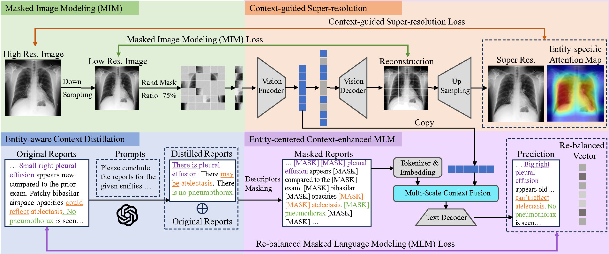

# ECAMP
The official implementation of "ECAMP: Entity-centered Context-aware Medical Vision Language Pre-training".  
Our paper can be found [here](https://arxiv.org/abs/2312.13316)


Some code is borrowed from [MAE](https://github.com/facebookresearch/mae), [huggingface](https://huggingface.co/) and [MRM](https://github.com/RL4M/MRM-pytorch)

## Installation
Clone this repository:
```
git clone https://github.com/ToniChopp/ECAMP.git
```
Install Python dependencies:
```
conda env create -f environment.yml
```

## Resource fetching
As of now, we exclusively offer pre-training code, focusing solely on illustrating the process of retrieving MIMIC-CXR data

- **MIMIC-CXR**: We downloaded the [MIMIC-CXR-JPG](https://physionet.org/content/mimic-cxr-jpg/2.0.0/) dataset as the radiographs. Paired medical reports can be downloaded in [MIMIC-CXR](https://physionet.org/content/mimic-cxr/2.0.0/mimic-cxr-reports.zip).


You can download ViTB/16 checkpoint [here](https://drive.google.com/file/d/17R2kjHPc9KE8jtuUarfnLvcsgNQMldOt/view?usp=drive_link) for pretraining.  
Our pre-trained model can be found [here](https://drive.google.com/file/d/1Tnj38eXDqKQAzuonaHeKhaWtpJFF7hwh/view?usp=drive_link).

**New:** Our distilled reports by LLM have been released. You can fetch them [here](https://drive.google.com/file/d/1I8Q8-sPnLb-kbD93wbCfZ4S_-xdBL3Md/view?usp=sharing)


## Pre-training
The **distilled report and attention weights** will be released **as soon as our paper is accepted**, but you can still use the original radiographs and report for pre-training.  
We pre-train ECAMP on MIMIC-CXR using this command:
```
cd ECAMP/ECAMP/Pre-training
chmod a+x run.sh
./run.sh
```
Note that it is flexible to develop other pre-training models under this framework.  


## Reference
If you have found our work valuable for your research, we kindly suggest that you acknowledge and cite our contribution(s) by referencing:

```
@misc{wang2023ecamp,
      title={ECAMP: Entity-centered Context-aware Medical Vision Language Pre-training}, 
      author={Rongsheng Wang and Qingsong Yao and Haoran Lai and Zhiyang He and Xiaodong Tao and Zihang Jiang and S. Kevin Zhou},
      year={2023},
      eprint={2312.13316},
      archivePrefix={arXiv},
      primaryClass={cs.CV}
}
```

Hope you enjoy!
