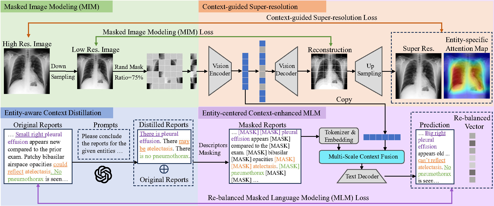
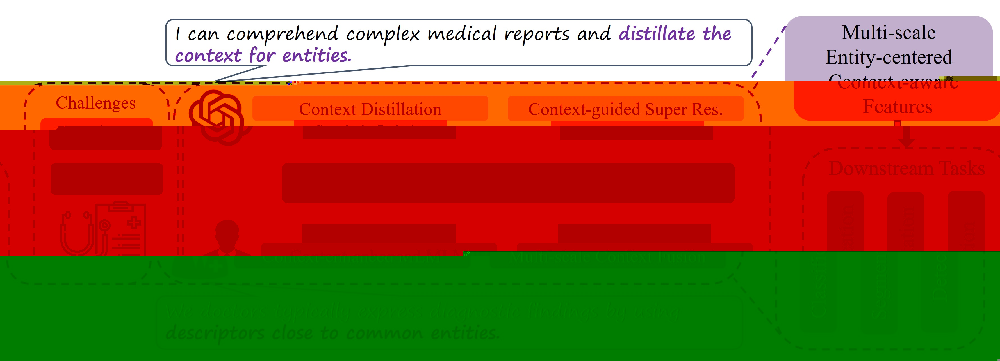

# ECAMP: Entity-centered Context-aware Medical Vision Language Pre-training



<div align="center">
    <span class="author-block">
    <a href="https://scholar.google.com/citations?user=rYP1nFEAAAAJ&hl=en" target="_blank">Rongsheng Wang</a><sup>1,2,6*</sup>,</span>
    <span class="author-block">
    <a href="https://scholar.google.com/citations?user=CMiRzlAAAAAJ&hl=en" target="_blank">Qingsong Yao</a><sup>3*</sup>,</span>
    <span class="author-block">
    <a href="https://scholar.google.com/citations?user=Wo8tMSMAAAAJ&hl=en" target="_blank">Zihang Jiang</a><sup>1,2†</sup>,</span>
    <span class="author-block">
    <a href="https://scholar.google.com/citations?user=y4RUE_YAAAAJ&hl=en" target="_blank">Haoran Lai</a><sup>1,2,6</sup>,</span>
    <span class="author-block">
    <a target="_blank">Zhiyang He</a><sup>6</sup>,</span>
    <span class="author-block">
    <a target="_blank">Xiaodong Tao</a><sup>6</sup>,</span>
    <span class="author-block">
    <a href="https://scholar.google.com/citations?user=8eNm2GMAAAAJ&hl=en" target="_blank">S. Kevin Zhou</a><sup>1,2,4,5†</sup>
    </span>
</div>
<div align="center">
    <p><sup>*</sup>Equal contribution. <sup>†</sup>Corresponding author.</p>
</div>


<br>

<div align="center">
    <sup>1</sup>
    <a target='_blank'>School of Biomedical Engineering, University of Science and Technology of China</a>&emsp;
    <br>
    <sup>2</sup> <a target='_blank'>Suzhou Institute for Advanced Research, University of Science and Technology of China</a>&emsp;
    <br>
    <sup>3</sup> <a target='_blank'>Stanford University, Palo Alto, CA, 94025, United States</a>&emsp;
    <br>
    <sup>4</sup> <a target='_blank'>Jingsu Provincial Key Laboratory of Multimodal Digital Twin Technology, Suzhou Jiangsu, 215123, China</a>&emsp;
    <br>
    <sup>5</sup> <a target='_blank'>Key Laboratory of Precision and Intelligent Chemistry, USTC, Hefei Anhui, 230026, China</a>&emsp;
    <br>
    <sup>6</sup> <a target='_blank'>Anhui IFLYTEK CO., Ltd.</a>
    <br>
</div>

<br>
<br>

​[](https://www.sciencedirect.com/science/article/pii/S1361841525002373?dgcid=coauthor)   [](https://github.com/ToniChopp/ECAMP)    <a href="#LICENSE--citation"></a>


**News** 🥰:

- ECAMP is accepted by Medical Image Analysis 2025! 🎉


## Introduction

Despite significant advancements in medical vision-language pre-training, existing methods have largely overlooked the inherent linguistic complexity and imbalanced issue within medical reports, as well as the complex cross-modality contextual relationships between texts and images. To close this gap, we propose a novel Entity-centered Context-aware Medical Vision-language Pre-training (ECAMP) framework, which establishes a more entity-centered, context-sensitive, and balanced understanding of medical reports to effectively pre-train the vision encoder. We first distill entity-centered context from medical reports utilizing large language models, enabling ECAMP to draw more precise supervision from the text modality. By further incorporating entity-aware re-balanced factor and descriptor masking strategies into masked language modeling, ECAMP significantly enhances the knowledge of entities within the reports. A context-guided super-resolution task is proposed alongside a multi-scale context fusion design to improve the semantic integration of both coarse and fine-level image representations, which prompts better performance for multi-scale downstream applications. ECAMP integrates these innovations together, leading to significant performance leaps over current state-of-the-art methods and establish a new standard for cross-modality pre-training in medical imaging. The effectiveness of ECAMP is demonstrated by extensive experiments on various domains and organs, which achieves cutting-edge results on multiple tasks including classification, segmentation, and detection across 5 public chest X-ray and 4 fundoscopy datasets respectively.

<!--  -->


## Installation
Clone this repository:
```
git clone https://github.com/ToniChopp/ECAMP.git
```
Install Python dependencies:
```
conda env create -f environment.yml
```


## Resource fetching
We offer the pre-training and fine-tuning code of ECAMP, whose contribution is **pre-training representative and multi-scale features from complex and imbalanced medical reports**. We pre-train our method both on MIMIC-CXR and FFA-IR dataset.

- **MIMIC-CXR**: We download the [MIMIC-CXR-JPG](https://physionet.org/content/mimic-cxr-jpg/2.0.0/) dataset as the radiographs. Paired medical reports can be downloaded in [MIMIC-CXR](https://physionet.org/content/mimic-cxr/2.0.0/mimic-cxr-reports.zip).
- **FFA-IR**: We download the [FFA-IR](https://physionet.org/content/ffa-ir-medical-report/1.0.0/) dataset as the fundus images and paired reports.


You can download ViTB/16 checkpoint [here](https://drive.google.com/file/d/17R2kjHPc9KE8jtuUarfnLvcsgNQMldOt/view?usp=drive_link) for pretraining.  
Our pre-trained model can be found [here](https://drive.google.com/file/d/1Tnj38eXDqKQAzuonaHeKhaWtpJFF7hwh/view?usp=drive_link) for evaluating.

Our distilled reports by LLM have been released. You can fetch them [here](https://drive.google.com/file/d/1I8Q8-sPnLb-kbD93wbCfZ4S_-xdBL3Md/view?usp=sharing)


## Pre-training
We pre-train ECAMP on MIMIC-CXR using this command:
```
cd ECAMP/ECAMP/Pre-training
chmod a+x run.sh
./run.sh
```
Note that it is flexible to develop other pre-training models under this framework.  


## Fine-tuning
We perform fine-tuning classification, linear probing classification, fine-tuning segmentation and detection for downstream tasks.

### Datasets

- **ChestX-ray14**: We download the [ChestX-ray14](https://nihcc.app.box.com/v/ChestXray-NIHCC) dataset using its official split for classification.
- **CheXpert**: We use the [CheXpert](https://stanfordmlgroup.github.io/competitions/chexpert/) consisting of 224,316 chest radiographs of 65,240 patients.
- **RSNA**: We use the stage 2 of [RSNA Pneumonia](https://www.rsna.org/rsnai/ai-image-challenge/rsna-pneumonia-detectionchallenge-2018) dataset.
- **COVIDx**: We use the version 7 of [COVIDx CXR](https://www.kaggle.com/datasets/andyczhao/covidx-cxr2/versions/7) dataset.
- **SIIM-ACR Pneumothorax**: We use the stage 1 of [SIIM-ACR Pneumothorax](https://www.kaggle.com/c/siim-acr-pneumothorax-segmentation).
- **ODIR-5K**: We download ODIR-5k from its [offical site](https://odir2019.grandchallenge.org/).
- **APTOS-2019**: We download APTOS-2019 from [Kaggle](https://www.kaggle.com/datasets/mariaherrerot/aptos2019).
- **MuReD**: We download MuRed from its [official site](https://data.mendeley.com/datasets/pc4mb3h8hz/1).
- **RIGA**: We download RIGA from its [official site](https://deepblue.lib.umich.edu/data/concern/data\_sets/3b591905z).


### Classification
We evaluate fine-tuning classification performance of our model using this command:
```
CUDA_VISIBLE_DEVICES=0 python train.py --name ecamp --stage train --model vit_base_patch16 --task ChestX-ray14 --num_classes 14 \
    --pretrained_path '$PATH TO ECAMP_ViT_Base_16.pth' --dataset_path '$PATH TO ChestX-ray14/' \
    --output_dir "output/ChestX-ray14/1/" --data_volume '1' --num_steps 3000  --eval_batch_size 512 --img_size 224 \
    --learning_rate 3e-2 --warmup_steps 50 --fp16 --fp16_opt_level O2 --train_batch_size 96
```
You can change ```--task``` to set specific dataset for fine-tuning classification. Here, 7 datasets are available: ChestX-ray14, CheXpert, RSNA, COVIDx, ODIR-5K, APTOS-2019 and MuReD. The ```--data_volume``` parameter can be set to identify the fraction of training data for fine-tuning.

*For linear probing classification, please set ```--mode``` to LinearProbe*.

### Segmentation
We evaluate fine-tuning segmentation performance of our model using this command:
```
CUDA_VISIBLE_DEVICES=0 python train.py --name ecamp --stage train --model vit_base_patch16 --task RSNA --img_size 224 \
    --pretrained_path '$PATH TO ECAMP_ViT_Base_16.pth' --dataset_path '$PATH TO RSNA/' \
    --output_dir "output/RSNA/1/" --data_volume '1' --num_steps 3000  --eval_batch_size 512 \
    --learning_rate 3e-4 --warmup_steps 50 --fp16 --fp16_opt_level O2 --train_batch_size 96 --weight_decay 0.05
```
You can change ```--task``` to set specific dataset for segmentation, where 3 datasets are available: SIIM, RSNA and RIGA. The ```--data_volume``` parameter can be set to identify the fraction of training data for fine-tuning.


### Detection
We evaluate fine-tuning detection performance of our model using this command:
```
CUDA_VISIBLE_DEVICES=0 python train.py --name ecamp --stage train --model vit_base_patch16 --task RSNA --img_size 224 \
    --pretrained_path '$PATH TO ECAMP_ViT_Base_16.pth' --dataset_path '$PATH TO RSNA/' \
    --output_dir "output/RSNA/1/" --data_volume '1' --num_steps 3000  --eval_batch_size 512 \
    --learning_rate 3e-4 --warmup_steps 50 --fp16 --fp16_opt_level O2 --train_batch_size 96 --weight_decay 0.05
```

### Acknowledgement
Some code is borrowed from [MAE](https://github.com/facebookresearch/mae), [huggingface](https://huggingface.co/) and [MRM](https://github.com/RL4M/MRM-pytorch).


## Reference
If you have found our work valuable for your research, we kindly suggest that you acknowledge and cite our contribution(s) by referencing:

```
@article{WANG2025ECAMP,
title = {ECAMP: Entity-centered Context-aware Medical Vision Language Pre-training},
journal = {Medical Image Analysis},
volume = {105},
pages = {103690},
year = {2025},
issn = {1361-8415},
doi = {https://doi.org/10.1016/j.media.2025.103690},
url = {https://www.sciencedirect.com/science/article/pii/S1361841525002373},
author = {Rongsheng Wang and Qingsong Yao and Zihang Jiang and Haoran Lai and Zhiyang He and Xiaodong Tao and S. Kevin Zhou},
keywords = {Medical Vision-language Pre-training, Masked Modeling, Cross-modality Learning},
abstract = {Despite significant advancements in medical vision-language pre-training, existing methods have largely overlooked the inherent linguistic complexity and imbalanced issue within medical reports, as well as the complex cross-modality contextual relationships between texts and images. To close this gap, we propose a novel Entity-centered Context-aware Medical Vision-language Pre-training (ECAMP) framework, which establishes a more entity-centered, context-sensitive, and balanced understanding of medical reports to effectively pre-train the vision encoder. We first distill entity-centered context from medical reports utilizing large language models, enabling ECAMP to draw more precise supervision from the text modality. By further incorporating entity-aware re-balanced factor and descriptor masking strategies into masked language modeling, ECAMP significantly enhances the knowledge of entities within the reports. A context-guided super-resolution task is proposed alongside a multi-scale context fusion design to improve the semantic integration of both coarse and fine-level image representations, which prompts better performance for multi-scale downstream applications. ECAMP integrates these innovations together, leading to significant performance leaps over current state-of-the-art methods and establish a new standard for cross-modality pre-training in medical imaging. The effectiveness of ECAMP is demonstrated by extensive experiments on various domains and organs, which achieves cutting-edge results on multiple tasks including classification, segmentation, and detection across 5 public chest X-ray and 4 fundoscopy datasets respectively.}
}
```


## License
This project is released under the MIT license. Please see the [LICENSE](LICENSE) file for more information.

Hope you enjoy!
